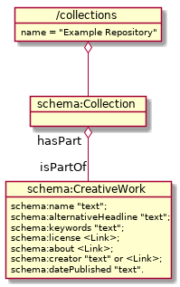
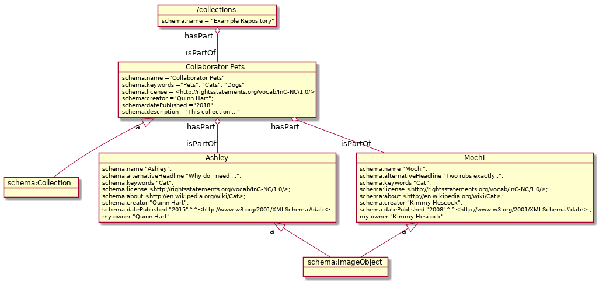

# Table of Contents

1.  [Example 1 - Collaborator Pets](#org09309de)
    1.  [Object Structure](#org2ad71b7)
    2.  [Administrative Privleges](#org09009e1)
    3.  [Make a New Collection](#org376d22c)
    4.  [Collection Access Control](#org15e1dc4)
    5.  [Check .fin/config.yml File](#orgadfd184)
    5.  [Add Example Data](#orgadfd185)
2.  [Graphs](#orgfd006fc)
3.  [Amended metadata representation](#org642851f)

# Example 1 - Collaborator Pets

Our collaborator pets collection is the most basic type of collection that can
be added into the DAMS. This example contains a simple set of digital images
with a small amount of data about the pets. Each pet, eg. [ashley.jpg](./ashley.jpg) is included
in their own image file, and each image file has some associated metadata in a
`.ttl` sidecar, eg. [ashley.jpeg.ttl](./ashley.jpeg.ttl). The metadata is in `text/turtle` format [text/turtle documentation](https://www.w3.org/TeamSubmission/turtle/).
The [index.ttl](./index.ttl) file includes information about the collection as a whole.
Finally, we have an additional [graph.hdt](./graph.hdt) file is explained in more detail below.

This collection can all be created with the [import.sh](./import.sh) script, and we will be
going through that script line-by-line to describe the general steps for
creating new collections.  Before we do that though, we first need to describe
the object structure in our <https://fedora.info/spec/>.

## Object Structure

Whereever possible, we use [Schema.org](https://schema.org/) to organize our collections and items.
To that end, Every collection is defined as a <https://schema.org/Collection> and every item in a
collection is a <https://schema.org/CreativeWork>. The items of a collection are defined
with the property <https://schema.org/hasPart>.  This is fundamental organization of a
collection. This [Generic Diagram](./docs/generic_diagram.png), describes that relationship.  Since
<https://schema.org/Collection> are themselves <https://schema.org/CreativeWork> then all properties of
those apply.  Some of the properties that are indexed and in some cases
faceted in our DAMS include <https://schema.org/name>, <https://schema.org/about>, <https://schema.org/keywords>,
<https://schema.org/alternativeHeadline>,<https://schema.org/license>,<https://schema.org/creator>,
<https://schema.org/datePublished>

Now, for our example, each individual pet is an item within our collection.  The
following diagram replaces the generic objects with some of the actual objects
in our collection.

## Administrative Privileges

If you have gone through the installation steps, this is good place to come as
your next step.  The steps below assume that you are currently logged in to your
fin server, as an admin.  How to do this is explained in the installation
instructions.  You can verify this with the following command, which access the
root location, and verifies you can write to this location.

    fin http get -P b / | grep fedora:writable

## Make a New Collection

Let&rsquo;s start with the collection description.  That&rsquo;s stored in the \`index.ttl\`
file.  This file describes the collection. \`index.ttl\` is a pretty easy file to
understand, you&rsquo;ll see a name, and description and some keywords.  If you&rsquo;re
savy with your linked data, you will see that by default we like to use
schema.org for our descriptions.  This is not a requirement for the server, but
lots of the DAMS setup expects to use this schema when indexing collections and
data.

    @prefix schema: <http://schema.org/> .
    @prefix rdf:  <http://www.w3.org/1999/02/22-rdf-syntax-ns#> .
    @prefix ldp:  <http://www.w3.org/ns/ldp#> .

    <>
      a ldp:BasicContainer, schema:Collection;
      schema:name "Collaborator Pets";
      schema:keywords "Pets", "Cats", "Dogs";
      schema:license <http://rightsstatements.org/vocab/InC-NC/1.0/>;
      schema:creator "Quinn Hart";
      schema:datePublished "2018"^^<http://www.w3.org/2001/XMLSchema#date>  ;
      schema:description "This collection includes pictures of pets that are owned by our collaborators.  This is meant to be something of the most basic collection that can be added as a DAMs." ;
      schema:identifier "ark:/pets/awesome".

fin has some special commands to create and administrate collections.  Let&rsquo;s
go ahead and create our new collection.

    fin collection create example_1-pets index.ttl

    New collection created at: /collection/example_1-pets

This command creates a new container in our system, for the new collection, but
it does more than that. It sets up some default access control conditions, and
organizes standard locations for things like groups for this collection. Also,
with the addition of the metadata in our index.ttl file, it also describes the
contents of this collection, which is then used in the default Interface for the
repository. After this step, you should be able to navigate to
<http://localhost:3000/fcrepo/rest/collection>, and see your newly created
example1-pets collection. You may need to login to your account via
<http://localhost:3000/auth/basic/login.html> to give your browser access.

## Collection Access Control

By default new collections are not publicly available.  Let&rsquo;s make this
available for anyone.

    fin collection acl user add example_1-pets foaf:Agent r

## Add Example Data

Now we want to add an additional image with its associated `.ttl` sidecar.

  1. Select an appropriately adorable jpg of one of your pets. In the event you don't have a pet, any cute animal picture will suffice.
  2. Navigate to `dams-example-collections/collection/ex1-pets/ex1-pets/pets`.
  3. Copy your selected jpg into this directory.
  4. Create a copy of one of the existing `name.jpg.ttl` files and update the file name to match the image you've chosen.
      
      Example
      
        `adorable_dog.jpg > adorable_dog.jpg.ttl`
        
  5. Update the information in your new `.ttl` sidecar file to personalize it and make it accurately reflect your chosen image.
  
You're ready to update your local copy of the DAMS Collaborator Pets Collection.
Open a Terminal and cd to `dams-example-collections/pets`. Then run the following command:
    
    fin io import [name of directory to upload] [root directory location]

   Example

     fin io import .
     
After the command runs, you should be able to refresh your local UC Davis Library Digital Collections instance and click on the Collaborator Pets image block.  You should now see your cute animal picture.

# Graphs

One problem that is currently not completely solved

# Amended metadata representation
